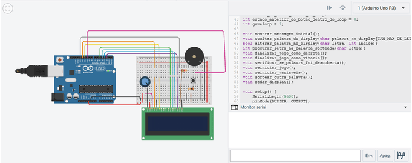

# RodaRoda

Projeto antigo feito para a disciplina "Laboratório de programação". É um jogo de adivinhação de palavras implementado em um arduíno. Foi feito em conjunto com Enzo Eduardo Cassiano Ibiapina. Tinkercad: https://www.tinkercad.com/things/83EYJHh6ece-rodaarodaprototipo 

## Instruções para jogar

1. Na protoboard, clique no botão para ligar o visor LCD;
2. Abra o monitor serial;
3. O jogo vai sortear uma palavra misteriosa. Digite uma letra que você acha que faz parte da palavra;
4. Se a letra estiver na palavra, o programa substitui "_" pela letra nas posições adequadas;
5. Se a letra não estiver na palavra, o buzzer toca para te irritar e você tem uma tentativa a menos para acertar;
6. Se você zerar o número de tentativas, o visor informa que você perdeu e revela a palavra...e o buzzer toca até você fechar o jogo ou apertar o botão da proboard pra reiniciar;
7. Se você acertar, o visor te parabeniza;

## GIF

Acabei me atrapalhando no recorte das imagens, então o GIF saiu meio irregular.

